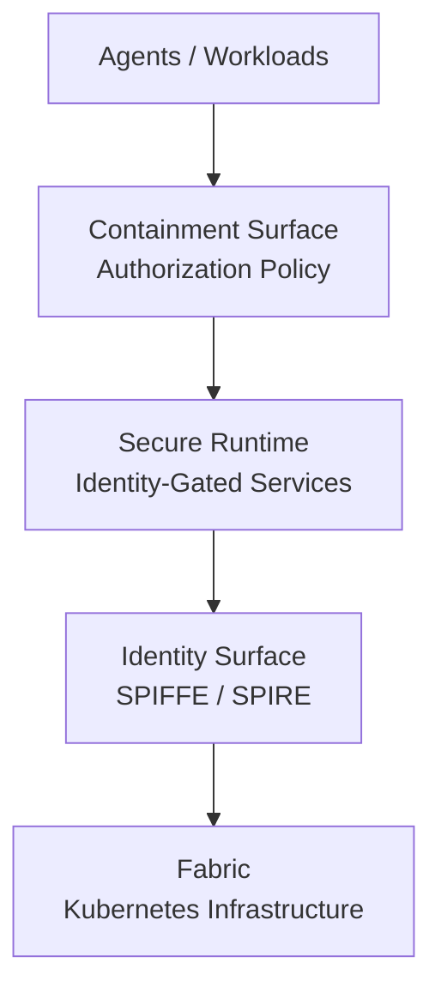

# Jeff Smith
Backend & Platform Engineer

Identity-first infrastructure • Durable authority systems • Deterministic backend design

---

## What I Work On

I design Kubernetes-based systems where identity, authority, and runtime behavior are explicit and inspectable.

My recent work focuses on:

- SPIRE / SPIFFE workload identity
- Admission and supply-chain enforcement
- Durable authority ledgers (PostgreSQL)
- Observable backend systems (Prometheus)
- Explicit architectural boundaries

I decompose large systems into bounded, self-contained slices that demonstrate clear properties and limits.

---

## ThreadForge Platform

ThreadForge is a layered platform architecture for executing distributed services and AI agents using workload identity, service mesh authentication, and policy-driven communication boundaries.

Platform reference architecture:

https://github.com/computeaholic/threadforge-reference-architecture

Platform Layers

threadforge-containment-surface
Policy-driven workload containment validation and redteam harness.

threadforge-secure-runtime
Identity-gated backend runtime with durable authority ledger and metrics.

threadforge-identity-surface
SPIRE-based workload identity plane with admission enforcement.

threadforge-fabric
Minimal Kubernetes substrate: registry, identity plane, Postgres, and Prometheus.

threadforge-agent-containment-lab
Demonstration of identity-based containment for AI agent workloads.

Backend Services

These repositories demonstrate deterministic backend design patterns.

Document Service
Deterministic domain modeling and validation.

Job Processor Service
Async worker architecture with explicit retry and failure boundaries.

Reservation Service
Transactional correctness and concurrency control.

Engineering Approach

Claims backed by artifacts

Fail-closed design

Minimal scope with explicit assumptions

Mechanical CI gates

Comfortable with rigorous review

AI tools are used to accelerate disciplined execution — not to replace engineering judgment.

Current Focus

Pursuing senior backend or platform engineering roles where architectural clarity and system integrity matter.

Open to limited, well-scoped consulting engagements.

Contact

Email: sendtojeffsmith@gmail.com

GitHub: https://github.com/computeaholic
